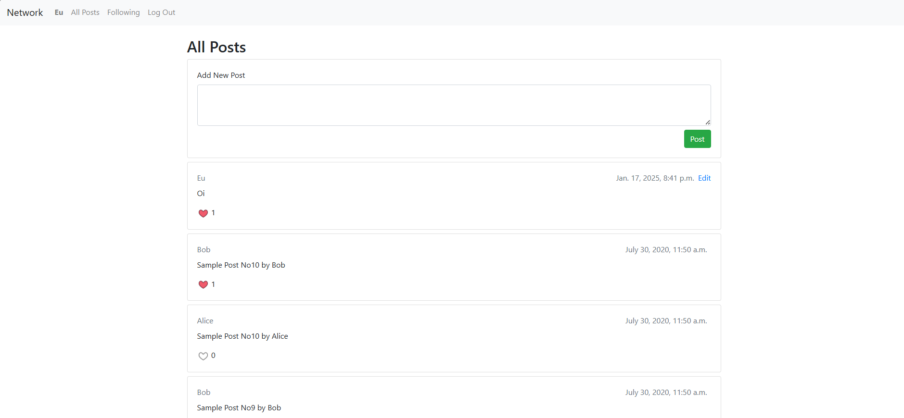

# 🌐 Social Network Platform


[Veja ao vivo](docs/Social.mp4)

Este é um projeto de plataforma de rede social desenvolvido com Django. Ele permite que os usuários criem e compartilhem posts, sigam outros usuários, curtam posts e gerenciem seus perfis.

## ✨ Funcionalidades

- 🔐 **Autenticação de Usuário**: Registro, login e logout de usuários.
- 📝 **Posts**: Criação, edição e visualização de posts.
- 👍 **Curtidas**: Usuários podem curtir ou descurtir posts.
- 👥 **Seguir Usuários**: Siga ou deixe de seguir outros usuários.
- 📄 **Perfis de Usuário**: Visualize e gerencie perfis de usuário.

## 🗂️ Estrutura do Projeto

- **ci.yaml**: Define um fluxo de integração contínua para executar testes automatizados em um ambiente configurado com PostgreSQL.
- **network**: Aplicativo principal contendo views, models e templates.
- **Pipfile**: Define as dependências do projeto e a versão do Python, facilitando o gerenciamento de pacotes.
- **Pipfile.lock**: Garante a consistência do ambiente bloqueando as versões exatas das dependências e subdependências.
- **models.py**: Arquivo que define as classes de modelo do Django, representando a estrutura do banco de dados com as tabelas User, Post e Profile, e seus relacionamentos.
- **dumydata.py**: Cria 10 posts de exemplo para dois usuários diferentes, user1 e user2, no banco de dados, usando o modelo Post. Cada post é salvo e seu conteúdo é impresso no console.Este script serve para gerar dados de exemplo, criando e salvando posts automaticamente para dois usuários no banco de dados.
- **manage.py**: Script de gerenciamento do Django.
- **requirements.txt**: Lista de dependências do projeto.

## 🛠️ Instalação

1. **Clone o repositório**:
```bash
   git clone https://github.com/larissadcew/Network-django
   cd Network-django
```
2.Realize as migrações do banco de dados:
```bash
python manage.py makemigrations
python manage.py migrate
```

3.Baixar dependencias:
```bash
pip install -r requirements.txt
```

4.Execute o servidor:
```bash
python manage.py runserver
```

Acesse a aplicação:
Abra o navegador e vá para http://127.0.0.1:8000/

🚀 Uso
📝 Criar Post: Após o login, crie um novo post.
👍 Curtir Posts: Veja os posts e curta ou descurta conforme desejar.
👥 Seguir Usuários: Siga ou deixe de seguir outros usuários para ver seus posts.
📄 Gerenciar Perfil: Visualize e edite seu perfil de usuário.


